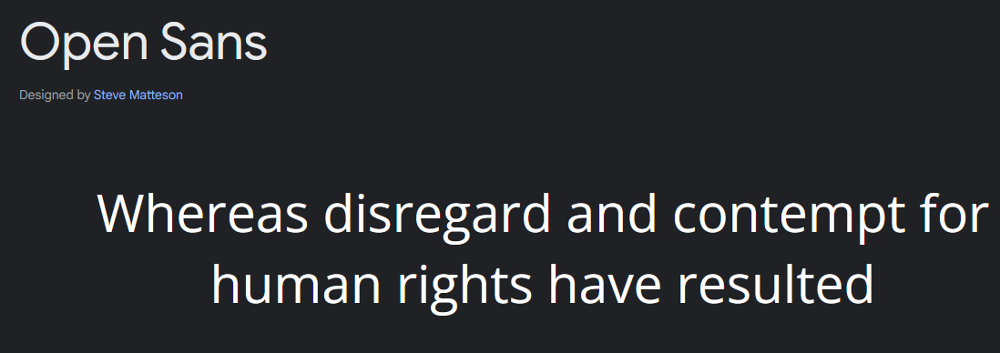

# EPA_frontend
<!-- # E0 :construction: -->

* :pencil2: **Nombre Grupo:** Completar nombre de grupo

## Descripción general :thought_balloon:

- ¿De qué se tratará el proyecto?
- ¿Cuál es el fin o la utilidad del proyecto?
- ¿Quiénes son los usuarios objetivo de su aplicación?

## Historia de Usuarios :busts_in_silhouette:

1. Como [visita] quiero [ver las caracteristicas de la aplicación] para [ver si me interesa unirme a esta]
2. Como [visita] quiero [ver los pasos a seguir para unirme] para [unirme fácilmente a la aplicación]
3. Como [usuario] quiero [crear chats nuevos] para [comunicarme con gente que no tenga chats anteriores]
4. Como [usuario] quiero [ver los chats en que he participado] para [acceder a ellos rápidamente]
5. Como [usuario] quiero [acceder a un chat específico] para [ver los mensajes de ese chat]
6. Como [usuario] quiero [enviar mensajes] para [comunicarme con otros usuarios]
7. Como [usuario] quiero [ver mensajes en tiempo real] para [ver mensajes que otros escriben en tiempo real]
8. Como [usuario] quiero [reportar a usuarios y mensajes] para [eliminar contenido no deseado]
9. Como [usuario de tercera edad] quiero [agrandar mensajes] para [leer bien lo que dicen]
10. Como [usuario de tercera edad] quiero [cambiar el tamaño de la letra] para [leer bien los mensajes en general]
11. Como [usuario de tercera edad] quiero [escuchar los mensajes] para [entender su contenido en caso de no poder leerlos]
12. Como [usuario de tercera edad] quiero [hablar para enviar mensajes] para [enviar mensajes cuando me cueste escribir en el teclado]
13. Como [administrador] quiero [ver todos los chats existentes] para [administrar su contenido]
14. Como [administrador] quiero [eliminar chats] para [limitar contenido no aceptado en la aplicación]
15. Como [administrador] quiero [eliminar usuarios] para [eliminar a usuarios que no cumplan con las normas de la aplicación]
16. Como [moderador de un chat] quiero [eliminar mensajes] para [eliminar mensajes que no cumplan con las normas del chat]
17. Como [moderador de un chat] quiero [expulsar usuarios] para [expulsar a usuarios que no cumplan con las normas del chat]
18. Como [moderador de un chat] quiero [silenciar usuarios] para [silenciar a usuarios que no cumplan con las normas del chat]
19. Como [moderador de un chat] quiero [ver los mensajes reportados] para [eliminar mensajes que no cumplan con las normas del chat]
20. Como [moderador de un chat] quiero [ver los usuarios reportados] para [expulsar a usuarios que no cumplan con las normas del chat]

## Diagrama Entidad-Relación :scroll:
<!-- Insertamos la imagen ER-Model.png -->

## Diseño Web :computer:

<!-- Documento de diseño web -->
### :art: Documento de diseño

<!-- Vistas principales -->
### :mag: Vistas principales

<!-- Logo -->
### :art: Logo

<!-- ejemplo de aplicacion -->
### :iphone: Ejemplo de aplicación

